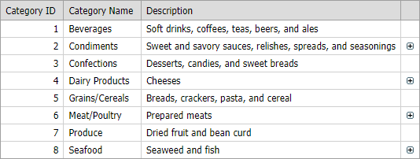

<!-- default badges list -->

<!-- default badges end -->

# Grid View for ASP.NET Web Forms - How to customize detail buttons
<!-- run online -->
**[[Run Online]](https://codecentral.devexpress.com/128533779/)**
<!-- run online end -->

This example demonstrates how to show detail buttons in random position (on the right side of the grid) and control button visibility in each row (hide buttons in odd rows).

## Files to Review

* [Default.aspx](./CS/Default.aspx) (VB: [Default.aspx](./VB/Default.aspx))
* [Default.aspx.cs](./CS/Default.aspx.cs) (VB: [Default.aspx.vb](./VB/Default.aspx.vb))

## Documentation

* [Access Controls in Templates on the Server](https://docs.devexpress.com/AspNet/403575/common-concepts/access-controls-in-templates-on-the-server)
